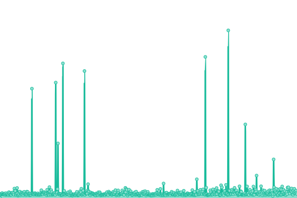

# [📈 Live Status](https://acumenlabs.github.io/status-page): <!--live status--> **🟩 All systems operational**

This repository contains the open-source uptime monitor and status page for [acumenlabs](https://acumenlabs.github.io/status-page), powered by [Upptime](https://github.com/upptime/upptime).

With [Upptime](https://upptime.js.org), you can get your own unlimited and free uptime monitor and status page, powered entirely by a GitHub repository. We use [Issues](https://github.com/acumenlabs/status-page/issues) as incident reports, [Actions](https://github.com/acumenlabs/status-page/actions) as uptime monitors, and [Pages](https://acumenlabs.github.io/status-page) for the status page.

<!--start: status pages-->
<!-- This summary is generated by Upptime (https://github.com/upptime/upptime) -->
<!-- Do not edit this manually, your changes will be overwritten -->
<!-- prettier-ignore -->
| URL | Status | History | Response Time | Uptime |
| --- | ------ | ------- | ------------- | ------ |
|  [Acumen Website](https://www.acumen.io) | 🟩 Up | [acumen-website.yml](https://github.com/acumenlabs/status-page/commits/HEAD/history/acumen-website.yml) | 

 237ms
     
 | 

<a href="https://status.acumen.io/history/acumen-website">100.00%</a>
    

|  Acumen API | 🟩 Up | [acumen-api.yml](https://github.com/acumenlabs/status-page/commits/HEAD/history/acumen-api.yml) | 

 135ms
     
 | 

<a href="https://status.acumen.io/history/acumen-api">100.00%</a>
    

|  Fetchers | 🟩 Up | [fetchers.yml](https://github.com/acumenlabs/status-page/commits/HEAD/history/fetchers.yml) | 

 470ms
     
 | 

<a href="https://status.acumen.io/history/fetchers">74.34%</a>
    

|  Processors | 🟩 Up | [processors.yml](https://github.com/acumenlabs/status-page/commits/HEAD/history/processors.yml) | 

 131ms
     
 | 

<a href="https://status.acumen.io/history/processors">85.11%</a>
    

<!--end: status pages-->

[**Visit our status website →**](https://acumenlabs.github.io/status-page)

## 📄 License

- Powered by: [Upptime](https://github.com/upptime/upptime)
- Code: [MIT](./LICENSE) © [acumenlabs](https://acumenlabs.github.io/status-page)
- Data in the `./history` directory: [Open Database License](https://opendatacommons.org/licenses/odbl/1-0/)
